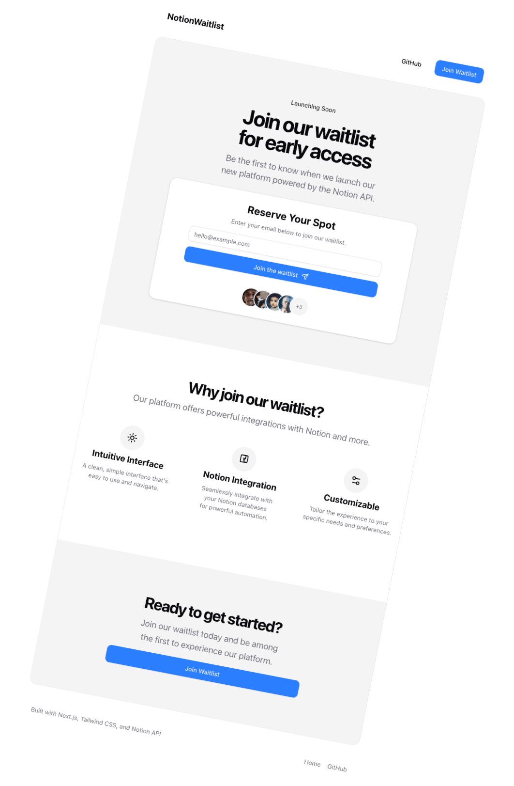

# NotionWaitlist - A Modern Waitlist App with Notion API Integration



This is a modern waitlist application built with Next.js App Router, TypeScript, Tailwind CSS, and ShadCN UI. It seamlessly integrates with the Notion API to store waitlist signups in a Notion database.

## Features

- 🚀 Built with Next.js 15, App Router and TypeScript
- 💅 Styled with Tailwind CSS & ShadCN UI
- 🔄 Notion API integration
- 📝 Form validation with Zod and React Hook Form
- 🔔 Toast notifications
- 📱 Fully responsive design

## Getting Started

### Prerequisites

- Node.js 18+
- A Notion account with API access
- A Notion database for storing waitlist entries

### Environment Variables

Create a `.env.local` file in the root directory and add the following:

```
NOTION_SECRET_AUTH=your_notion_integration_secret
NOTION_WAITLIST_DATABASE_ID=your_database_id
```

### Installation

1. Clone the repository:

   ```bash
   git clone https://github.com/yourusername/notion-nextjs-waitlist-starter-kit.git
   cd notion-nextjs-waitlist-starter-kit
   ```

2. Install dependencies:

   ```bash
   npm install
   ```

3. Run the development server:

   ```bash
   npm run dev
   ```

4. Open [http://localhost:3000](http://localhost:3000) in your browser.

## Notion Setup

1. Create a table in Notion with at least an "Email" field as a title field
2. Create a new integration at [https://www.notion.so/my-integrations](https://www.notion.so/my-integrations)
3. Copy the integration secret to your `.env.local` file
4. Share your Notion database with the integration
5. Get the database ID from the URL and add it to your `.env.local` file

## Deployment

This application can be easily deployed to Vercel:

[](https://vercel.com/new/clone?repository-url=https%3A%2F%2Fgithub.com%2Fyourusername%2Fnotion-waitlist-app)

## License

This project is licensed under the MIT License - see the LICENSE file for details.
